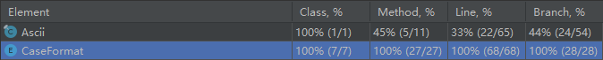
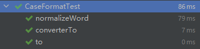
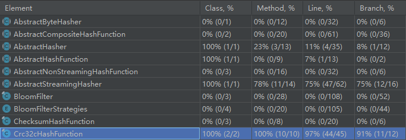
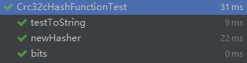
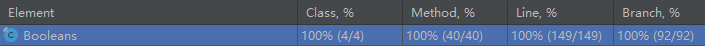
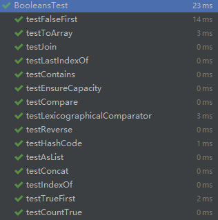
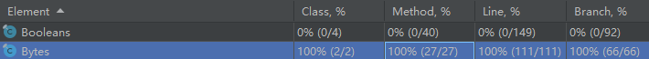
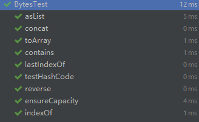

# 项目报告

## 小组成员

- 谢建福；
- 李宇恒；

## 测试环境

- Windows 10；
- JDK 8；
- Maven；
- Intellij IDEA；

## 测试工具

### JUnit 4

>  JUnit是一个Java语言的单元测试框架。它由Kent Beck和Erich Gamma建立，逐渐成为源于Kent Beck的sUnit的xUnit家族中最为成功的一个。 JUnit有它自己的JUnit扩展生态圈。多数Java的开发环境都已经集成了JUnit作为单元测试的工具。

### Jacoco

> Jacoco是一个开源的代码覆盖率工具，可以嵌入到Ant 、Maven中，并提供了EclEmma Eclipse插件,也可以使用JavaAgent技术监控Java程序。很多第三方的工具提供了对Jacoco的集成，如sonar、Jenkins等。

## 测试内容

- 谢建福
  - com.google.common.base.CaseFormat；
  - com.google.common.hash.Crc32cHashFunctionTest；
  - com.google.common.primitives.BooleansTest；
  - com.google.common.primitives.BytesTest；
- 李宇恒
  - ；
  - ；
  - ；

## 测试标准

- Line Coverage: above **90%**
- Branch/Decision Coverage: above **90%**

## 测试方式

以函数/方法作为测试的基本对象，把被测函数/方法内部调用的函数/方法作为测试代码的一部分一起覆盖，对被测代码做 Line Coverage 和 Branch/Decision Coverage。

## 测试分析

### com.google.common.base.CaseFormat

#### 覆盖情况



#### 测试结果



#### 测试对象

##### to()

- 功能：实现格式转换，格式共有五种，包括LOWER_CAMEL，UPPER_CAMEL，LOWER_HYPHEN，LOWER_UNDERSCORE，UPPER_UNDERSCORE。

- ```java
  public final String to(CaseFormat format, String str) {
      checkNotNull(format);
      checkNotNull(str);
      return (format == this) ? str : convert(format, str);
  }
  /** Enum values can override for performance reasons. */
  String convert(CaseFormat format, String s) {
      // deal with camel conversion
      StringBuilder out = null;
      int i = 0;
      int j = -1;
      while ((j = wordBoundary.indexIn(s, ++j)) != -1) {
          if (i == 0) {
              // include some extra space for separators
              out = new StringBuilder(s.length() + 4 * format.wordSeparator.length());
              out.append(format.normalizeFirstWord(s.substring(i, j)));
          } else {
              requireNonNull(out).append(format.normalizeWord(s.substring(i, j)));
          }
          out.append(format.wordSeparator);
          i = j + wordSeparator.length();
      }
      return (i == 0)
          ? format.normalizeFirstWord(s)
          : requireNonNull(out).append(format.normalizeWord(s.substring(i))).toString();
  }
  ```

- 测试代码

  - 分析代码，提供所有特殊格式转换的测试样例；
  
  - ```java
    @Test
    public void to() {
        assertEquals("helloWorld", CaseFormat.LOWER_HYPHEN.to(CaseFormat.LOWER_CAMEL, "hello-world"));	
        assertEquals("HelloWorld", CaseFormat.LOWER_HYPHEN.to(CaseFormat.UPPER_CAMEL, "hello-world"));
        assertEquals("hello-world", CaseFormat.LOWER_HYPHEN.to(CaseFormat.LOWER_HYPHEN, "hello-world"));
        assertEquals("hello_world", CaseFormat.LOWER_HYPHEN.to(CaseFormat.LOWER_UNDERSCORE, "hello-world"));
        assertEquals("HELLO_WORLD", CaseFormat.LOWER_HYPHEN.to(CaseFormat.UPPER_UNDERSCORE, "hello-world"));
    
        assertEquals("hello", CaseFormat.LOWER_UNDERSCORE.to(CaseFormat.LOWER_CAMEL, "hello"));
        assertEquals("helloWorld", CaseFormat.LOWER_UNDERSCORE.to(CaseFormat.LOWER_CAMEL, "hello_world"));
        assertEquals("helloWorldWorld", CaseFormat.LOWER_UNDERSCORE.to(CaseFormat.LOWER_CAMEL, "hello_world_world"));
        assertEquals("HelloWorld", CaseFormat.LOWER_UNDERSCORE.to(CaseFormat.UPPER_CAMEL, "hello_world"));
        assertEquals("hello-world", CaseFormat.LOWER_UNDERSCORE.to(CaseFormat.LOWER_HYPHEN, "hello_world"));
        assertEquals("hello_world", CaseFormat.LOWER_UNDERSCORE.to(CaseFormat.LOWER_UNDERSCORE, "hello_world"));
        assertEquals("HELLO_WORLD", CaseFormat.LOWER_UNDERSCORE.to(CaseFormat.UPPER_UNDERSCORE, "hello_world"));
    
        assertEquals("helloWorld", CaseFormat.UPPER_UNDERSCORE.to(CaseFormat.LOWER_CAMEL, "HELLO_WORLD"));
        assertEquals("HelloWorld", CaseFormat.UPPER_UNDERSCORE.to(CaseFormat.UPPER_CAMEL, "HELLO_WORLD"));
        assertEquals("hello-world", CaseFormat.UPPER_UNDERSCORE.to(CaseFormat.LOWER_HYPHEN, "HELLO_WORLD"));
        assertEquals("hello_world", CaseFormat.UPPER_UNDERSCORE.to(CaseFormat.LOWER_UNDERSCORE, "HELLO_WORLD"));
        assertEquals("HELLO_WORLD", CaseFormat.UPPER_UNDERSCORE.to(CaseFormat.UPPER_UNDERSCORE, "HELLO_WORLD"));
    }
    ```

##### converterTo()

- 功能：获取由当前格式转换到目标格式的转换器

- ```java
  public Converter<String, String> converterTo(CaseFormat targetFormat) {
    return new StringConverter(this, targetFormat);
  }
  ```

- 测试代码

  - 获取转换器，并验证转换器的功能是否匹配；
  
  - ```java
    @Test
    public void converterTo() {
        Converter<String, String> converter = CaseFormat.LOWER_CAMEL.converterTo(CaseFormat.UPPER_UNDERSCORE);
        assertEquals("HELLO_WORLD", converter.convert("helloWorld"));
        assertEquals("helloWorld", converter.correctedDoBackward("HELLO_WORLD"));
        assertEquals("LOWER_CAMEL.converterTo(UPPER_UNDERSCORE)", converter.toString());
        assertEquals(CaseFormat.LOWER_CAMEL.hashCode() ^ CaseFormat.UPPER_UNDERSCORE.hashCode(), converter.hashCode());
        assertEquals(converter, CaseFormat.LOWER_CAMEL.converterTo(CaseFormat.UPPER_UNDERSCORE));
        assertNotEquals(converter, CaseFormat.LOWER_CAMEL.converterTo(CaseFormat.LOWER_UNDERSCORE));
        assertNotEquals(converter, CaseFormat.UPPER_CAMEL.converterTo(CaseFormat.UPPER_UNDERSCORE));
        assertNotEquals(converter, new Object());
    }
    ```

##### LOWER_HYPHEN.normalizeWord()

- 功能：获得当前字符串的标准化字符串

- ```java
  String normalizeWord(String word) {
    return Ascii.toLowerCase(word);
  }
  ```

- 测试代码

  - ```java
    assertEquals("hello-world", CaseFormat.LOWER_HYPHEN.normalizeWord("Hello-World"));
    ```

##### LOWER_UNDERSCORE.normalizeWord()

- 功能：获得当前字符串的标准化字符串

- ```java
  String normalizeWord(String word) {
    return Ascii.toLowerCase(word);
  }
  ```

- 测试代码

  - ```java
    assertEquals("hello_world", CaseFormat.LOWER_UNDERSCORE.normalizeWord("Hello_World"));
    ```

##### LOWER_CAMEL.normalizeWord()

- 功能：获得当前字符串的标准化字符串

- ```java
  String normalizeWord(String word) {
    return firstCharOnlyToUpper(word);
  }
  ```

- 测试代码

  - 验证字符串为空和不为空时函数功能是否正常；
  
  - ```java
    assertEquals("", CaseFormat.LOWER_CAMEL.normalizeWord(""));
    assertEquals("Helloworld", CaseFormat.LOWER_CAMEL.normalizeWord("HElloWorld"));
    ```

##### UPPER_CAMEL.normalizeWord()

- 功能：获得当前字符串的标准化字符串

- ```java
  String normalizeWord(String word) {
    return firstCharOnlyToUpper(word);
  }
  ```

- 测试代码

  - ```java
    assertEquals("Helloworld", CaseFormat.UPPER_CAMEL.normalizeWord("helloWorld"));
    ```

##### UPPER_UNDERSCORE.normalizeWord()

- 功能：获得当前字符串的标准化字符串

- ```java
  String normalizeWord(String word) {
    return Ascii.toUpperCase(word);
  }
  ```

- 测试代码

  - ```java
    assertEquals("HELLO_WORLD", CaseFormat.UPPER_UNDERSCORE.normalizeWord("Hello_World"));
    ```

### com.google.common.hash.Crc32cHashFunctionTest

#### 覆盖情况



#### 测试结果



#### 测试对象

##### bits()

- 功能：获取Crc32算法使用的位数

- ```java
  public int bits() {
    return 32;
  }
  ```

- 测试代码

  - ```java
    public void bits() {
        assertEquals(32, new Crc32cHashFunction().bits());
    }
    ```

##### newHasher()

- 功能：返回Crc32cHasher对象，该对象可用于对输入内容生成CRC32C校验码。

- ```java
  public Hasher newHasher() {
    return new Crc32cHasher();
  }
  
  static final class Crc32cHasher extends AbstractStreamingHasher {
  
      Crc32cHasher() {
        super(16);
      }
  
      private boolean finished = false;
  
      private int crc0 = INVERSE_COMPUTE_FOR_WORD_OF_ALL_1S;
      private int crc1 = 0;
      private int crc2 = 0;
      private int crc3 = 0;
  
      @Override
      protected void process(ByteBuffer bb) {
        if (finished) {
          throw new IllegalStateException(
              "The behavior of calling any method after calling hash() is undefined.");
        }
        while (bb.remaining() >= 16) {
          crc0 = computeForWord(crc0);
          crc1 = computeForWord(crc1);
          crc2 = computeForWord(crc2);
          crc3 = computeForWord(crc3);
          crc0 ^= bb.getInt();
          crc1 ^= bb.getInt();
          crc2 ^= bb.getInt();
          crc3 ^= bb.getInt();
        }
      }
  
      @Override
      protected void processRemaining(ByteBuffer bb) {
        if (finished) {
          return;
        }
        crc0 = combine(0, crc0);
        crc0 = combine(crc0, crc1);
        crc0 = combine(crc0, crc2);
        crc0 = combine(crc0, crc3);
        while (bb.hasRemaining()) {
          crc0 = (crc0 >>> 8) ^ BYTE_TABLE[(bb.get() ^ crc0) & 0xFF];
        }
        finished = true;
      }
  
      @Override
      protected HashCode makeHash() {
        if (!finished) {
  
          processRemaining(EMPTY);
        }
        return HashCode.fromInt(~crc0);
      }
  
      static final int[] BYTE_TABLE = {
        ...
      };
  
      static final int[][] STRIDE_TABLE = {
        ...
      };
      static final int INVERSE_COMPUTE_FOR_WORD_OF_ALL_1S = 0xeee3ddcd;
  
      static int computeForWord(int word) {
        return STRIDE_TABLE[3][word & 0xFF]
            ^ STRIDE_TABLE[2][(word >>> 8) & 0xFF]
            ^ STRIDE_TABLE[1][(word >>> 16) & 0xFF]
            ^ STRIDE_TABLE[0][word >>> 24];
      }
  
      static int combine(int csum, int crc) {
        csum ^= crc;
        for (int i = 0; i < 4; i++) {
          csum = (csum >>> 8) ^ BYTE_TABLE[csum & 0xFF];
        }
        return csum;
      }
  
      private static final ByteBuffer EMPTY = ByteBuffer.allocate(0);
    }
  ```
  
- 测试代码

  - 验证hasher的每一个方法是否正常；
  
  - ```java
    public void newHasher() {
        Hasher hasher = new Crc32cHashFunction().newHasher();
        hasher.putBoolean(false);
        hasher.putByte((byte)123);
        hasher.putChar('a');
        hasher.putFloat(123.123f);
        hasher.putBytes(new byte[]{1,2});
        assertEquals(109479762, hasher.hash().asInt());
        assertEquals(109479762, hasher.hash().asInt());
        hasher = new Crc32cHashFunction().newHasher();
        hasher.putBytes(ByteBuffer.allocate(12).order(ByteOrder.LITTLE_ENDIAN).putLong(123));
        hasher.putBytes(ByteBuffer.allocate(12).order(ByteOrder.LITTLE_ENDIAN).putLong(123));
        hasher.putBytes(ByteBuffer.allocate(12).order(ByteOrder.LITTLE_ENDIAN).putLong(123));
        hasher.putBytes(ByteBuffer.allocate(12).order(ByteOrder.LITTLE_ENDIAN).putLong(123));
        hasher.putBytes(ByteBuffer.allocate(12).order(ByteOrder.LITTLE_ENDIAN).putLong(123));
        hasher.putBytes(ByteBuffer.allocate(12).order(ByteOrder.LITTLE_ENDIAN).putLong(123));
        hasher.putBytes(ByteBuffer.allocate(12).order(ByteOrder.LITTLE_ENDIAN).putLong(123));
        hasher.putBytes(ByteBuffer.allocate(20).order(ByteOrder.LITTLE_ENDIAN).putLong(123));
        assertEquals(1499445213, hasher.hash().asInt());
        hasher = new Crc32cHashFunction().newHasher();
        assertEquals(0, hasher.hash().asInt());
    }
    ```

##### toString()

- 功能：输出Hash生成的校验码类型

- ```java
  public String toString() {
    return "Hashing.crc32c()";
  }
  ```

- 测试代码

  - ```java
    public void testToString() {
        assertEquals("Hashing.crc32c()", new Crc32cHashFunction().toString());
    }
    ```

### com.google.common.primitives.BooleansTest

#### 覆盖情况



#### 测试结果



#### 测试对象

##### trueFirst()

- 功能：返回boolean类型的比较器，true优先，表现在列表排序时为true在前；

- ```java
  public static Comparator<Boolean> trueFirst() {
    return BooleanComparator.TRUE_FIRST;
  }
  /** Comparators for {@code Boolean} values. */
  private enum BooleanComparator implements Comparator<Boolean> {
      TRUE_FIRST(1, "Booleans.trueFirst()"),
      FALSE_FIRST(-1, "Booleans.falseFirst()");
  
      private final int trueValue;
      private final String toString;
  
      BooleanComparator(int trueValue, String toString) {
          this.trueValue = trueValue;
          this.toString = toString;
      }
  
      @Override
      public int compare(Boolean a, Boolean b) {
          int aVal = a ? trueValue : 0;
          int bVal = b ? trueValue : 0;
          return bVal - aVal;
      }
  
      @Override
      public String toString() {
          return toString;
      }
  }
  ```

- 测试代码

  - ```java
    @Test
    public void testTrueFirst() {
        Comparator<Boolean> comparator = Booleans.trueFirst();
        List<Boolean> actual = new ArrayList<Boolean>(){{
            add(false);
            add(true);
            add(false);
        }};
        List<Boolean> expected = new ArrayList<Boolean>(){{
            add(true);
            add(false);
            add(false);
        }};
        actual.sort(comparator);
        assertEquals(expected, actual);
        assertEquals("Booleans.trueFirst()", comparator.toString());
    }
    ```

##### falseFirst()

- 功能：返回boolean类型的比较器，false优先，表现在列表排序时为false在前；

- ```java
  public static Comparator<Boolean> trueFirst() {
    return BooleanComparator.FALSE_FIRST;
  }
  /** Comparators for {@code Boolean} values. */
  private enum BooleanComparator implements Comparator<Boolean> {
      TRUE_FIRST(1, "Booleans.trueFirst()"),
      FALSE_FIRST(-1, "Booleans.falseFirst()");
  
      private final int trueValue;
      private final String toString;
  
      BooleanComparator(int trueValue, String toString) {
          this.trueValue = trueValue;
          this.toString = toString;
      }
  
      @Override
      public int compare(Boolean a, Boolean b) {
          int aVal = a ? trueValue : 0;
          int bVal = b ? trueValue : 0;
          return bVal - aVal;
      }
  
      @Override
      public String toString() {
          return toString;
      }
  }
  ```

- 测试代码

  - ```java
    @Test
    public void testFalseFirst() {
        Comparator<Boolean> comparator = Booleans.falseFirst();
        List<Boolean> actual = new ArrayList<Boolean>(){{
            add(false);
            add(true);
            add(false);
        }};
        List<Boolean> expected = new ArrayList<Boolean>(){{
            add(false);
            add(false);
            add(true);
        }};
        actual.sort(comparator);
        assertEquals(expected, actual);
        assertEquals("Booleans.falseFirst()", comparator.toString());
    }
    ```

##### hashCode()

- 功能：返回hashcode值

- ```java
  public static int hashCode(boolean value) {
    return value ? 1231 : 1237;
  }
  ```

- 测试代码

  - ```java
    @Test
    public void testHashCode() {
        assertEquals(1231, Booleans.hashCode(true));
        assertEquals(1237, Booleans.hashCode(false));
    }
    ```

##### compare()

- 功能：比较两个boolean的大小

- ```java
  public static int compare(boolean a, boolean b) {
    return (a == b) ? 0 : (a ? 1 : -1);
  }
  ```

- 测试代码

  - 枚举全部四种输入情况进行测试
  
  - ```java
    @Test
    public void testCompare() {
        assertEquals(0, Booleans.compare(true, true));
        assertEquals(0, Booleans.compare(false, false));
        assertEquals(1, Booleans.compare(true, false));
        assertEquals(-1, Booleans.compare(false, true));
    }
    ```

##### contains()

- 功能：判断一个数组是否包含目标元素

- ```java
  public static boolean contains(boolean[] array, boolean target) {
    for (boolean value : array) {
      if (value == target) {
        return true;
      }
    }
    return false;
  }
  ```

- 测试代码

  - 分别测试 存在false和true / 仅存在false / 仅存在true 三种情况；
  
  - ```java
    @Test
    public void testContains() {
        boolean[] list = new boolean[] {
                false, true, false
        };
        assertTrue(Booleans.contains(list, true));
        assertTrue(Booleans.contains(list, false));
        boolean[] list2 = new boolean[] {
                false, false
        };
        assertFalse(Booleans.contains(list2, true));
        assertTrue(Booleans.contains(list2, false));
        boolean[] list3 = new boolean[] {
                true, true
        };
        assertTrue(Booleans.contains(list3, true));
        assertFalse(Booleans.contains(list3, false));
    }
    ```

##### indexOf()

- 功能：在数组中从左往右查找目标元素，如果存在返回下标，如果不存在返回-1

- ```java
  public static int indexOf(boolean[] array, boolean target) {
    return indexOf(array, target, 0, array.length);
  }
  private static int indexOf(boolean[] array, boolean target, int start, int end) {
      for (int i = start; i < end; i++) {
          if (array[i] == target) {
              return i;
          }
      }
      return -1;
  }
  public static int indexOf(boolean[] array, boolean[] target) {
      checkNotNull(array, "array");
      checkNotNull(target, "target");
      if (target.length == 0) {
          return 0;
      }
  
      outer:
      for (int i = 0; i < array.length - target.length + 1; i++) {
          for (int j = 0; j < target.length; j++) {
              if (array[i + j] != target[j]) {
                  continue outer;
              }
          }
          return i;
      }
      return -1;
  }
  ```
  
- 测试代码

  - 分别验证元素/序列存在数组和不存在数组两种情况；
  
  - ```java
    @Test
    public void testIndexOf() {
        boolean[] list = new boolean[] {
                false, true, false
        };
        assertEquals(1, Booleans.indexOf(list, true));
        assertEquals(0, Booleans.indexOf(list, false));
        boolean[] list2 = new boolean[] {
                false, false
        };
        assertEquals(-1, Booleans.indexOf(list2, true));
        assertEquals(0, Booleans.indexOf(list2, false));
        assertEquals(0, Booleans.indexOf(list, new boolean[]{}));
        assertEquals(1, Booleans.indexOf(list, new boolean[]{ true, false }));
        assertEquals(-1, Booleans.indexOf(list, new boolean[]{ false, false }));
    }
    ```

##### lastIndexOf()

- 功能：在数组中从右往左查找目标元素，如果存在返回下标，如果不存在返回-1

- ```java
  public static int lastIndexOf(boolean[] array, boolean target) {
    return lastIndexOf(array, target, 0, array.length);
  }
  ```

- 测试代码

  - 分别验证元素存在和不存在序列两种情况；
  
  - ```java
    @Test
    public void testLastIndexOf() {
        boolean[] list = new boolean[] {
                false, true, false
        };
        assertEquals(1, Booleans.lastIndexOf(list, true));
        assertEquals(2, Booleans.lastIndexOf(list, false));
        boolean[] list2 = new boolean[] {
                false, false
        };
        assertEquals(-1, Booleans.lastIndexOf(list2, true));
        assertEquals(1, Booleans.lastIndexOf(list2, false));
    }
    ```

##### concat()

- 功能：拼接多个数组

- ```java
  public static boolean[] concat(boolean[]... arrays) {
    int length = 0;
    for (boolean[] array : arrays) {
      length += array.length;
    }
    boolean[] result = new boolean[length];
    int pos = 0;
    for (boolean[] array : arrays) {
      System.arraycopy(array, 0, result, pos, array.length);
      pos += array.length;
    }
    return result;
  }
  ```

- 测试代码

  - ```java
    @Test
    public void testConcat() {
        boolean[] list = new boolean[] {
                false, true, false
        };
        boolean[] list2 = new boolean[] {
                false, false
        };
        assertEquals(5, Booleans.concat(list, list2).length);
    }
    ```

##### ensureCapacity()

- 功能：复制原数组，并扩充到到新的长度，并在后面补上padding

- ```java
  public static boolean[] ensureCapacity(boolean[] array, int minLength, int padding) {
    checkArgument(minLength >= 0, "Invalid minLength: %s", minLength);
    checkArgument(padding >= 0, "Invalid padding: %s", padding);
    return (array.length < minLength) ? Arrays.copyOf(array, minLength + padding) : array;
  }
  ```

- 测试代码

  - 分别测试新长度小于原长和大于等于原长两种情况；
  
  - ```java
        @Test
        public void testEnsureCapacity() {
            boolean[] list = new boolean[] {
                    false, true, false
            };
            boolean[] res = Booleans.ensureCapacity(list, 5, 3);
            assertEquals(8, res.length);
            res = Booleans.ensureCapacity(list, 2, 3);
            assertSame(list, res);
            try {
                res = Booleans.ensureCapacity(list, -1, 3);
                fail();
            } catch (IllegalArgumentException e) {
            }
            try {
                res = Booleans.ensureCapacity(list, 1, -3);
                fail();
            } catch (IllegalArgumentException e) {
            }
        }
    ```

##### join()

- 功能：将数组元素使用分隔符拼接成一个字符串

- ```java
  public static String join(String separator, boolean... array) {
    checkNotNull(separator);
    if (array.length == 0) {
      return "";
    }
  
    // For pre-sizing a builder, just get the right order of magnitude
    StringBuilder builder = new StringBuilder(array.length * 7);
    builder.append(array[0]);
    for (int i = 1; i < array.length; i++) {
      builder.append(separator).append(array[i]);
    }
    return builder.toString();
  }
  ```

- 测试代码

  - 分别测试空和非空两种情况；
  
  - ```java
    @Test
    public void testJoin() {
        assertEquals("false,true,false", Booleans.join(",", false, true, false));
        assertEquals("", Booleans.join(","));
    }
    ```

##### lexicographicalComparator()

- 功能：返回按字典序比较的比较器

- ```java
  public static Comparator<boolean[]> lexicographicalComparator() {
    return LexicographicalComparator.INSTANCE;
  }
  private enum LexicographicalComparator implements Comparator<boolean[]> {
      INSTANCE;
  
      @Override
      public int compare(boolean[] left, boolean[] right) {
          int minLength = Math.min(left.length, right.length);
          for (int i = 0; i < minLength; i++) {
              int result = Booleans.compare(left[i], right[i]);
              if (result != 0) {
                  return result;
              }
          }
          return left.length - right.length;
      }
  
      @Override
      public String toString() {
          return "Booleans.lexicographicalComparator()";
      }
  }
  ```

- 测试代码

  - 验证comparator的功能；
  
  - ```java
    @Test
    public void testLexicographicalComparator() {
        Comparator<boolean[]> comparator = Booleans.lexicographicalComparator();
        assertTrue(comparator.compare(new boolean[]{}, new boolean[]{false}) < 0);
        assertTrue(comparator.compare(new boolean[]{false}, new boolean[]{false, true}) < 0);
        assertTrue(comparator.compare(new boolean[]{false, true}, new boolean[]{true}) < 0);
        assertEquals("Booleans.lexicographicalComparator()", comparator.toString());
    }
    ```

##### toArray()

- 功能：将集合类容器转换成数组

- ```java
  public static boolean[] toArray(Collection<Boolean> collection) {
    if (collection instanceof BooleanArrayAsList) {
      return ((BooleanArrayAsList) collection).toBooleanArray();
    }
  
    Object[] boxedArray = collection.toArray();
    int len = boxedArray.length;
    boolean[] array = new boolean[len];
    for (int i = 0; i < len; i++) {
      // checkNotNull for GWT (do not optimize)
      array[i] = (Boolean) checkNotNull(boxedArray[i]);
    }
    return array;
  }
  ```

- 测试代码

  -  通过验证array的长度来测试功能；
  
  - ```java
    @Test
    public void testToArray() {
        List<Boolean> list = new ArrayList<Boolean>(){{
            add(false);
            add(true);
            add(false);
        }};
        boolean[] res = Booleans.toArray(list);
        assertEquals(3, res.length);
        res = Booleans.toArray(Booleans.asList(false,true,false));
        assertEquals(3, res.length);
    }
    ```

##### asList()

- 功能：将元素列表转换成List容器

- ```java
  public static List<Boolean> asList(boolean... backingArray) {
    if (backingArray.length == 0) {
      return Collections.emptyList();
    }
    return new BooleanArrayAsList(backingArray);
  }
  ```

- 测试代码

  - 转换成BooleanArrayAsList类型，并测试BooleanArrayAsList类的方法

  - ```java
        @Test
        public void testAsList() {
            List<Boolean> res = Booleans.asList(false,true,false);
            assertEquals(3, res.size());
            assertFalse(res.isEmpty());
            assertTrue(res.contains(false));
            assertFalse(res.contains(0));
            assertFalse(Booleans.asList(true, true).contains(false));
            assertEquals(1, res.indexOf(true));
            assertEquals(2, res.lastIndexOf(false));
            res.set(1, false);
            assertEquals(-1, res.indexOf(true));
            assertEquals(-1, res.lastIndexOf(true));
            assertEquals(-1, res.indexOf(1));
            assertEquals(-1, res.lastIndexOf(1));
            assertEquals(Boolean.FALSE, res.get(1));
            assertEquals(0, res.subList(0,0).size());
            assertEquals(Boolean.FALSE, res.subList(0,1).get(0));
            assertEquals(1, res.subList(0,1).size());
            assertTrue(res.equals(res));
            assertTrue(res.equals(Booleans.asList(false, false, false)));
            assertFalse(res.equals(Booleans.asList(true, false, false)));
            assertFalse(res.equals(Booleans.asList(false, false)));
            assertFalse(res.equals(new boolean[]{false, false}));
            assertEquals(1258132, res.hashCode());
            assertEquals("[false, false, false]", res.toString());
            res = Booleans.asList();
            assertEquals(0, res.size());
            assertTrue(res.isEmpty());
            assertEquals("[true, true]", Booleans.asList(true, true).toString());
        }
    ```

##### countTrue()

- 功能：计算值为true的元素的数量

- ```java
  public static int countTrue(boolean... values) {
    int count = 0;
    for (boolean value : values) {
      if (value) {
        count++;
      }
    }
    return count;
  }
  ```

- 测试代码

  - ```java
    @Test
    public void testCountTrue() {
        assertEquals(2, Booleans.countTrue(false, true, true, false));
    }
    ```

##### reverse()

- 功能：数组翻转

- ```java
  public static void reverse(boolean[] array) {
    checkNotNull(array);
    reverse(array, 0, array.length);
  }
  
  public static void reverse(boolean[] array, int fromIndex, int toIndex) {
    checkNotNull(array);
    checkPositionIndexes(fromIndex, toIndex, array.length);
    for (int i = fromIndex, j = toIndex - 1; i < j; i++, j--) {
      boolean tmp = array[i];
      array[i] = array[j];
      array[j] = tmp;
    }
  }
  ```

- 测试代码

  - 测试翻转之后每个位置的元素值和长度是否正确；
  
  - ```java
    @Test
    public void testReverse() {
        boolean[] tmp = new boolean[]{false, false, true};
        Booleans.reverse(tmp);
        assertTrue(tmp[0]);
        assertFalse(tmp[1]);
        assertFalse(tmp[2]);
        assertEquals(3, tmp.length);
    }
    ```

### com.google.common.primitives.BytesTest


#### 覆盖情况



#### 测试结果



#### 测试对象

先初始化一些测试样例

```java
private byte[] arr1 = new byte[]{ 1, 2, 3, 4, 5, 1, 2, 3, 4, 5};
private byte[] zeros = new byte[]{ 0, 0, 0 };
private byte[] empty = new byte[]{};
```

##### hashCode()

- 功能：返回该元素的哈希值

- ```java
  public static int hashCode(byte value) {
    return value;
  }
  ```

- 测试代码

  - ```java
      public void testHashCode() {
          assertEquals(1, Bytes.hashCode((byte) 1));
      }
      ```

##### contains()

- 功能：判断数组内是否存在目标元素

- ```java
  public static boolean contains(byte[] array, byte target) {
    for (byte value : array) {
      if (value == target) {
        return true;
      }
    }
    return false;
  }
  ```

- 测试代码

  - ```java
    @Test
    public void contains() {
        assertTrue(Bytes.contains(arr1, (byte) 1));
        assertFalse(Bytes.contains(arr1, (byte) 0));
    }
    ```

##### indexOf()

- 功能：在数组中从左往右查找目标元素，如果存在返回下标，如果不存在返回-1

- ```java
  public static int indexOf(byte[] array, byte target) {
    return indexOf(array, target, 0, array.length);
  }
  
  private static int indexOf(byte[] array, byte target, int start, int end) {
    for (int i = start; i < end; i++) {
      if (array[i] == target) {
        return i;
      }
    }
    return -1;
  }
  public static int indexOf(byte[] array, byte[] target) {
    checkNotNull(array, "array");
    checkNotNull(target, "target");
    if (target.length == 0) {
      return 0;
    }
  
    outer:
    for (int i = 0; i < array.length - target.length + 1; i++) {
      for (int j = 0; j < target.length; j++) {
        if (array[i + j] != target[j]) {
          continue outer;
        }
      }
      return i;
    }
    return -1;
  }
  ```

- 测试代码

  - ```java
    @Test
    public void indexOf() {
        assertEquals(2, Bytes.indexOf(arr1, (byte) 3));
        assertEquals(-1, Bytes.indexOf(arr1, (byte) 0));
        assertEquals(0, Bytes.indexOf(arr1, empty));
        assertEquals(1, Bytes.indexOf(arr1, new byte[]{2,3}));
        assertEquals(-1, Bytes.indexOf(arr1, new byte[]{2,1}));
    }
    ```

##### lastIndexOf()

- 功能：在数组中从右往左查找目标元素，如果存在返回下标，如果不存在返回-1

- ```java
  public static int lastIndexOf(byte[] array, byte target) {
    return lastIndexOf(array, target, 0, array.length);
  }
  
  private static int lastIndexOf(byte[] array, byte target, int start, int end) {
    for (int i = end - 1; i >= start; i--) {
      if (array[i] == target) {
        return i;
      }
    }
    return -1;
  }
  ```

- 测试代码

  - ```java
    @Test
    public void lastIndexOf() {
        assertEquals(7, Bytes.lastIndexOf(arr1, (byte) 3));
        assertEquals(-1, Bytes.lastIndexOf(arr1, (byte) 0));
    }
    ```

##### concat()

- 功能：拼接多个数组

- ```java
  public static byte[] concat(byte[]... arrays) {
    int length = 0;
    for (byte[] array : arrays) {
      length += array.length;
    }
    byte[] result = new byte[length];
    int pos = 0;
    for (byte[] array : arrays) {
      System.arraycopy(array, 0, result, pos, array.length);
      pos += array.length;
    }
    return result;
  }
  ```

- 测试代码

  - ```java
    @Test
    public void concat() {
        byte[] res = Bytes.concat(arr1, zeros, empty);
        assertEquals(13, res.length);
        assertEquals(3, res[2]);
        assertEquals(5, res[9]);
        assertEquals(0, res[10]);
    }
    ```

##### ensureCapacity()

- 功能：复制原数组，并扩充到到新的长度，并在后面补上padding

- ```java
  public static byte[] ensureCapacity(byte[] array, int minLength, int padding) {
    checkArgument(minLength >= 0, "Invalid minLength: %s", minLength);
    checkArgument(padding >= 0, "Invalid padding: %s", padding);
    return (array.length < minLength) ? Arrays.copyOf(array, minLength + padding) : array;
  }
  ```

- 测试代码

  - ```java
    @Test
    public void ensureCapacity() {
        byte[] res = Bytes.ensureCapacity(arr1, 5, 3);
        assertSame(res, res);
        res = Bytes.ensureCapacity(arr1, 11, 3);
        assertEquals(14, res.length);
        try {
            res = Bytes.ensureCapacity(arr1, -1, 3);
            fail();
        } catch (IllegalArgumentException e) {
        }
        try {
            res = Bytes.ensureCapacity(arr1, 1, -3);
            fail();
        } catch (IllegalArgumentException e) {
        }
    }
    ```

##### toArray()

- 功能：将集合类容器转换成数组

- ```java
  public static byte[] toArray(Collection<? extends Number> collection) {
    if (collection instanceof ByteArrayAsList) {
      return ((ByteArrayAsList) collection).toByteArray();
    }
  
    Object[] boxedArray = collection.toArray();
    int len = boxedArray.length;
    byte[] array = new byte[len];
    for (int i = 0; i < len; i++) {
      // checkNotNull for GWT (do not optimize)
      array[i] = ((Number) checkNotNull(boxedArray[i])).byteValue();
    }
    return array;
  }
  ```

- 测试代码

  - ```java
    @Test
    public void toArray() {
        List<Number> list = new ArrayList<Number>(){{
           add(1);
           add(2);
           add(3);
        }};
        byte[] res = Bytes.toArray(list);
        assertEquals(3, res.length);
        assertEquals(1, res[0]);
        assertEquals(2, res[1]);
        assertEquals(3, res[2]);
        res = Bytes.toArray(Bytes.asList((byte)1, (byte)2, (byte)3));
        assertEquals(3, res.length);
        assertEquals(1, res[0]);
        assertEquals(2, res[1]);
        assertEquals(3, res[2]);
    }
    ```

##### asList()

- 功能：转换成ByteArrayAsList类型，并测试ByteArrayAsList类的方法

- ```java
  public static List<Byte> asList(byte... backingArray) {
    if (backingArray.length == 0) {
      return Collections.emptyList();
    }
    return new ByteArrayAsList(backingArray);
  }
  
  @GwtCompatible
  private static class ByteArrayAsList extends AbstractList<Byte>
      implements RandomAccess, Serializable {
    final byte[] array;
    final int start;
    final int end;
  
    ByteArrayAsList(byte[] array) {
      this(array, 0, array.length);
    }
  
    ByteArrayAsList(byte[] array, int start, int end) {
      this.array = array;
      this.start = start;
      this.end = end;
    }
  
    @Override
    public int size() {
      return end - start;
    }
  
    @Override
    public boolean isEmpty() {
      return false;
    }
  
    @Override
    public Byte get(int index) {
      checkElementIndex(index, size());
      return array[start + index];
    }
  
    @Override
    public boolean contains(@CheckForNull Object target) {
      // Overridden to prevent a ton of boxing
      return (target instanceof Byte) && Bytes.indexOf(array, (Byte) target, start, end) != -1;
    }
  
    @Override
    public int indexOf(@CheckForNull Object target) {
      // Overridden to prevent a ton of boxing
      if (target instanceof Byte) {
        int i = Bytes.indexOf(array, (Byte) target, start, end);
        if (i >= 0) {
          return i - start;
        }
      }
      return -1;
    }
  
    @Override
    public int lastIndexOf(@CheckForNull Object target) {
      // Overridden to prevent a ton of boxing
      if (target instanceof Byte) {
        int i = Bytes.lastIndexOf(array, (Byte) target, start, end);
        if (i >= 0) {
          return i - start;
        }
      }
      return -1;
    }
  
    @Override
    public Byte set(int index, Byte element) {
      checkElementIndex(index, size());
      byte oldValue = array[start + index];
      // checkNotNull for GWT (do not optimize)
      array[start + index] = checkNotNull(element);
      return oldValue;
    }
  
    @Override
    public List<Byte> subList(int fromIndex, int toIndex) {
      int size = size();
      checkPositionIndexes(fromIndex, toIndex, size);
      if (fromIndex == toIndex) {
        return Collections.emptyList();
      }
      return new ByteArrayAsList(array, start + fromIndex, start + toIndex);
    }
  
    @Override
    public boolean equals(@CheckForNull Object object) {
      if (object == this) {
        return true;
      }
      if (object instanceof ByteArrayAsList) {
        ByteArrayAsList that = (ByteArrayAsList) object;
        int size = size();
        if (that.size() != size) {
          return false;
        }
        for (int i = 0; i < size; i++) {
          if (array[start + i] != that.array[that.start + i]) {
            return false;
          }
        }
        return true;
      }
      return super.equals(object);
    }
  
    @Override
    public int hashCode() {
      int result = 1;
      for (int i = start; i < end; i++) {
        result = 31 * result + Bytes.hashCode(array[i]);
      }
      return result;
    }
  
    @Override
    public String toString() {
      StringBuilder builder = new StringBuilder(size() * 5);
      builder.append('[').append(array[start]);
      for (int i = start + 1; i < end; i++) {
        builder.append(", ").append(array[i]);
      }
      return builder.append(']').toString();
    }
  
    byte[] toByteArray() {
      return Arrays.copyOfRange(array, start, end);
    }
  
    private static final long serialVersionUID = 0;
  }
  ```

- 测试代码

  - ```java
    @Test
    public void asList() {
        List<Byte> res = Bytes.asList();
        assertEquals(0, res.size());
        assertTrue(res.isEmpty());
        res = Bytes.asList((byte)1, (byte)2, (byte)3);
        assertEquals(3, res.size());
        assertEquals(1, (byte)res.get(0));
        assertEquals(2, (byte)res.get(1));
        assertEquals(3, (byte)res.get(2));
        assertFalse(res.isEmpty());
        assertEquals(true, res.contains((byte) 1));
        assertEquals(false, res.contains((byte) -1));
        assertEquals(false, res.contains(new Object()));
        assertEquals(-1, res.indexOf(new Object()));
        assertEquals(0, res.indexOf((byte) 1));
        assertEquals(-1, res.indexOf((byte) -1));
        assertEquals(-1, res.lastIndexOf(new Object()));
        assertEquals(-1, res.lastIndexOf((byte) -1));
        res.set(2, (byte)1);
        assertEquals(2, res.lastIndexOf((byte) 1));
        assertEquals(0, res.subList(0, 0).size());
        assertEquals(2, res.subList(0, 2).size());
        assertEquals(2, (byte)res.subList(0, 2).get(1));
        assertEquals(true, res.equals(res));
        assertEquals(true, res.equals(Bytes.asList((byte)1, (byte)2, (byte)1)));
        assertEquals(false, res.equals(Bytes.asList((byte)1, (byte)2, (byte)3)));
        assertEquals(false, res.equals(Bytes.asList((byte)1, (byte)2)));
        assertEquals(false, res.equals(Arrays.asList((byte)1, (byte)2)));
        assertEquals("[1, 2, 1]", res.toString());
        assertEquals(30815, res.hashCode());
    }
    ```

##### reverse()

- 功能：数组翻转

- ```java
  public static void reverse(byte[] array, int fromIndex, int toIndex) {
    checkNotNull(array);
    checkPositionIndexes(fromIndex, toIndex, array.length);
    for (int i = fromIndex, j = toIndex - 1; i < j; i++, j--) {
      byte tmp = array[i];
      array[i] = array[j];
      array[j] = tmp;
    }
  }
  ```

- 测试代码

  - ```java
    @Test
    public void reverse() {
        byte[] arr = new byte[]{1,2,3};
        Bytes.reverse(arr);
        assertEquals(3, arr.length);
        assertEquals(3, arr[0]);
        assertEquals(2, arr[1]);
        assertEquals(1, arr[2]);
    }
    ```

## 为什么Crc32cHashFunctionTest没有达到 100% 的覆盖率

- 存在部分代码不对外开放，并且出现该问题的条件苛刻、情况罕见，很难通过编写输入参数覆盖相关代码；

- 例如，

  - 下面代码为Crc32cHashFunctionTest的protected方法process中部分代码，该部分代码未被覆盖

      - ```java
        if (finished) {
                throw new IllegalStateException(
                    "The behavior of calling any method after calling hash() is undefined.");
              }
        ```

  - 其中finished为对象内部private修饰符修饰的变量

    - ```java
      private boolean finished = false;
      ```


### 改进方法

- 使用反射的方式，修改类内部private变量的数值，进行测试；

## 无法提高测试覆盖率的原因

### Line Coverage

1. 存在死代码，该部分死代码永远不会被执行；

### Branch Coverage

1. 存在分支要求的条件矛盾，无法被满足；

   - eg.

     - ```java
       if(A == 1) {
       	if(A == 0) {
       		print('hello world!');
       	}
       }
       ```

